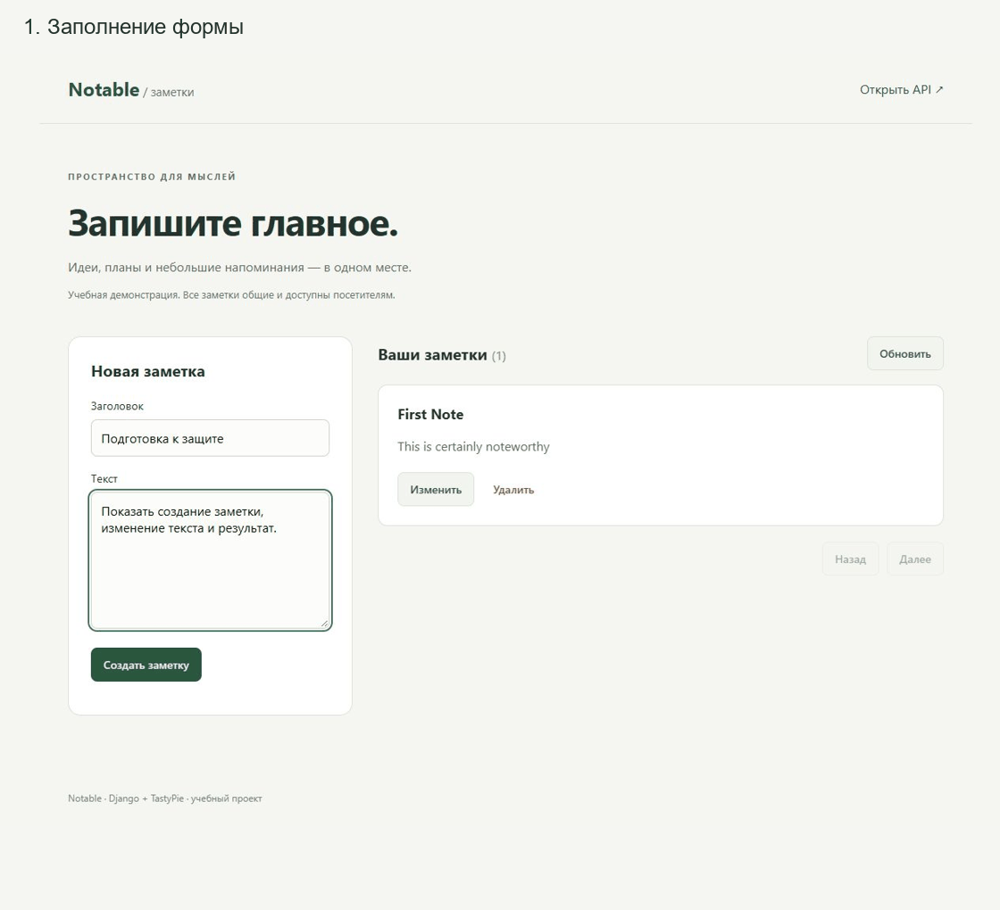

# Notable — заметки на Django

Учебное приложение с личными заметками, REST API и браузерным интерфейсом. Владелец работает со своими записями; аудитор читает все записи; суперпользователь управляет всеми заметками.

Основа: [Create a Django API in Under 20 Minutes](https://codeburst.io/create-a-django-api-in-under-20-minutes-2a082a60f6f3). [Каталог проектов](https://github.com/practical-tutorials/project-based-learning#python).

**GitHub:** [https://github.com/dreizziq/practice](https://github.com/dreizziq/practice)

## Стек

Python, Django 5.2.17, TastyPie 0.15.1, SQLite, HTML, CSS, JavaScript. Настройки также поддерживают PostgreSQL; проверка копирования и восстановления выполнена для SQLite.

## Локальный запуск

Python 3.13 или 3.14. В PowerShell из корня проекта:

```powershell
powershell -ExecutionPolicy Bypass -File .\start.ps1
```

Или вручную:

```powershell
python -m venv .venv
.\.venv\Scripts\python.exe -m pip install -r requirements.txt
.\.venv\Scripts\python.exe manage.py migrate
.\.venv\Scripts\python.exe manage.py seed_demo
.\.venv\Scripts\python.exe manage.py runserver
```

Открыть http://127.0.0.1:8000/ . Вход: `student1`, `student2` или `auditor`; пароль новых локальных тестовых аккаунтов: `PracticeDemo2026!`. Остановка: Ctrl+C. Для собственных данных смените тестовые пароли. `seed_demo` не сбрасывает пароли существующих пользователей.

## API и права

Все запросы требуют сессии Django после входа. Изменяющие запросы дополнительно требуют заголовок `X-CSRFToken`. Интерфейс передаёт его автоматически.

| Метод | Маршрут | Результат |
| --- | --- | --- |
| GET | /api/note/ | Список доступных заметок с пагинацией, 200 |
| POST | /api/note/ | Создание собственной заметки, 201 |
| GET | /api/note/{id}/ | Одна доступная заметка, 200 |
| PUT | /api/note/{id}/ | Изменение, 204 |
| DELETE | /api/note/{id}/ | Удаление, 204 |

POST и PUT: `Content-Type: application/json`, тело `{"title":"Заметка","body":"Текст"}`. Заголовок и текст обязательны; заголовок до 200 символов. Чужая запись скрыта от обычного пользователя. Аудитору запрещены изменения. Поле владельца назначает сервер. Массовое удаление отключено.

[Аккаунты и сценарии проверки](docs/ACCESS.md). [Запросы Postman](Notable.postman_collection.json).

## База данных и резервные копии

Заметка связана обязательным внешним ключом с пользователем. Непустые значения проверяются формой и ограничениями БД. Удаление владельца с заметками запрещено.

```powershell
.\.venv\Scripts\python.exe manage.py backup_database --output backups/copy.sqlite3
.\.venv\Scripts\python.exe manage.py restore_database backups/copy.sqlite3 --output backups/restored.sqlite3
```

Команды создают новые файлы и отказываются перезаписывать существующие. Восстановление проверяет SHA-256 и целостность базы. [Подробности](docs/DATABASE.md), [результат проверки](docs/backup-verification.json).

## Проверки

```powershell
.\.venv\Scripts\python.exe manage.py check
.\.venv\Scripts\python.exe manage.py test
```

Локально пройдены 16 тестов: CRUD, валидация, изоляция пользователей, роли, CSRF, копирование и восстановление. Внешняя оценка Code Climate A/B не подтверждена; конфигурация сервиса не является результатом анализа.

## Демонстрация и отчёты



- [Сценарий демонстрации](docs/DEMO.md).
- [Таблица соответствия](docs/TRACEABILITY.md).

Для пересборки Word-отчётов: установить `requirements-report.txt` и выполнить `python tools/fill_reports.py` (Windows, шрифт Times New Roman). Исходные шаблоны находятся в `docs/templates`. Скрипт `tools/build_submission.py` обновляет текстовые материалы. PDF экспортируются из Word.
